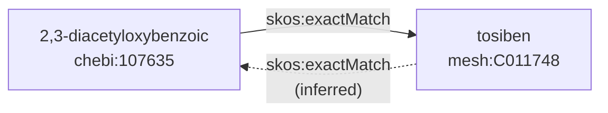
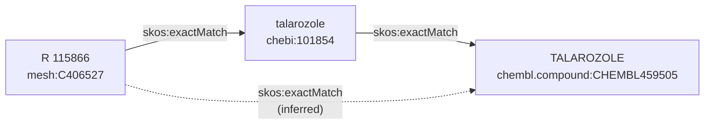
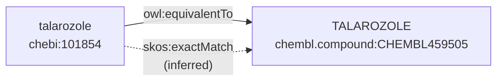
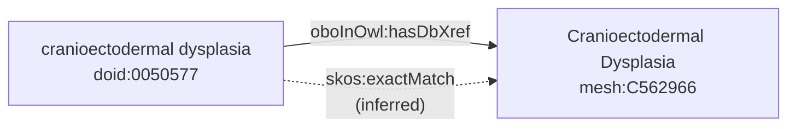
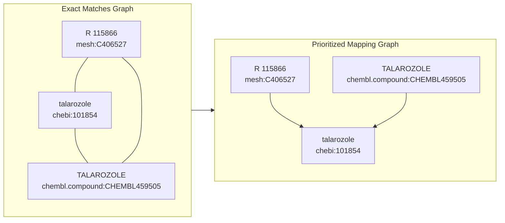

<p align="center">
  
</p>

<h1 align="center">
  SeMRA
</h1>

<p align="center">
    <a href="https://github.com/biopragmatics/semra/actions/workflows/tests.yml">
        </a>
    <a href="https://pypi.org/project/semra">
        </a>
    <a href="https://pypi.org/project/semra">
        </a>
    <a href="https://github.com/biopragmatics/semra/blob/main/LICENSE">
        </a>
    <a href='https://semra.readthedocs.io/en/latest/?badge=latest'>
        </a>
    <a href="https://codecov.io/gh/biopragmatics/semra/branch/main">
        </a>  
    <a href="https://github.com/cthoyt/cookiecutter-python-package">
        </a>
    <a href="https://github.com/astral-sh/ruff">
        </a>
    <a href="https://github.com/biopragmatics/semra/blob/main/.github/CODE_OF_CONDUCT.md">
        </a>
    <a href="https://zenodo.org/badge/latestdoi/10987909">
        </a>
</p>

The Semantic Mapping Reasoner and Assembler (SeMRA) is a Python package that
provides:

1. An object model for semantic mappings (based on SSSOM)
2. Functionality for assembling and reasoning over semantic mappings at scale
3. A provenance model for automatically generated mappings
4. A confidence model granular at the curator-level, mapping set-level, and
   community feedback-level

We also provide an accompanying raw semantic mapping database on Zenodo at
https://zenodo.org/records/15208251.

## 💪 Getting Started

Here's a demonstration of SeMRA's object, provenance, and cascading confidence
model:

```python
from semra import Reference, Mapping, EXACT_MATCH, SimpleEvidence, MappingSet, MANUAL_MAPPING

r1 = Reference(prefix="chebi", identifier="107635", name="2,3-diacetyloxybenzoic")
r2 = Reference(prefix="mesh", identifier="C011748", name="tosiben")

mapping = Mapping(
   subject=r1, predicate=EXACT_MATCH, object=r2,
   evidence=[
      SimpleEvidence(
         justification=MANUAL_MAPPING,
         confidence=0.99,
         author=Reference(prefix="orcid", identifier="0000-0003-4423-4370", name="Charles Tapley Hoyt"),
         mapping_set=MappingSet(
            name="biomappings", license="CC0", confidence=0.90,
         ),
      )
   ]
)
```

### Assembly

Mappings can be assembled from many source formats using functions in the
`semra.io` submodule:

```python
import semra.io

# load mappings from any standardized SSSOM file as a file path or URL, via `pandas.read_csv`
sssom_url = "https://w3id.org/biopragmatics/biomappings/sssom/biomappings.sssom.tsv"
mappings = semra.io.from_sssom(
   sssom_url, license="spdx:CC0-1.0", mapping_set_title="biomappings",
)

# alternatively, metadata can be passed via a file/URL
mappings_alt = semra.io.from_sssom(
   sssom_url,
   metadata="https://w3id.org/biopragmatics/biomappings/sssom/biomappings.sssom.yml"
)

# load mappings from the Gene Ontology (via OBO format)
go_mappings = semra.io.from_pyobo("go")

# load mappings from the Uber Anatomy Ontology (via OWL format)
uberon_mappings = semra.io.from_bioontologies("uberon")
```

SeMRA also implements custom importers in the `semra.sources` submodule. It's
based on a pluggable architecture (via
[`class-resovler`](https://github.com/cthoyt/class-resolver)) so additional
custom sources can be incorporated without modifying the SeMRA source code.

```python
from semra.sources import get_omim_gene_mappings

omim_gene_mappings = get_omim_gene_mappings()
```

### Inference

SeMRA implements the chaining and inference rules described in the
[SSSOM](https://mapping-commons.github.io/sssom/chaining-rules/) specification.
The first rule is
[inversions](https://mapping-commons.github.io/sssom/chaining-rules/#inverse-rules):

```python
from semra import Mapping, EXACT_MATCH, Reference
from semra.inference import infer_reversible

r1 = Reference(prefix="chebi", identifier="107635", name="2,3-diacetyloxybenzoic")
r2 = Reference(prefix="mesh", identifier="C011748", name="tosiben")

mapping = Mapping(subject=r1, predicate=EXACT_MATCH, object=r2)

# includes the mesh -> exact match-> chebi mapping with full provenance
mappings = infer_reversible([mapping])
```



The second rule is about
[transitivity](https://mapping-commons.github.io/sssom/chaining-rules/#transitivity-rule).
This means some predicates apply over chains. SeMRA further implements
configuration for two-length chains and could be extended to arbitrary chains.

```python
from semra import Reference, Mapping, EXACT_MATCH
from semra.inference import infer_chains

r1 = Reference.from_curie("mesh:C406527", name="R 115866")
r2 = Reference.from_curie("chebi:101854", name="talarozole")
r3 = Reference.from_curie("chembl.compound:CHEMBL459505", name="TALAROZOLE")

m1 = Mapping(subject=r1, predicate=EXACT_MATCH, object=r2)
m2 = Mapping(subject=r2, predicate=EXACT_MATCH, object=r3)

# infers r1 -> exact match -> r3
mappings = infer_chains([m1, m2])
```



The third rule is
[generalization](https://mapping-commons.github.io/sssom/chaining-rules/#generalisation-rules),
which means that a more strict predicate can be relaxed to a less specific
predicate, like `owl:equivalentTo` to `skos:exactMatch`.

```python
from semra import Reference, Mapping, EXACT_MATCH
from semra.inference import infer_generalizations

r1 = Reference.from_curie("chebi:101854", name="talarozole")
r2 = Reference.from_curie("chembl.compound:CHEMBL459505", name="TALAROZOLE")

m1 = Mapping(subject=r1, predicate=EXACT_MATCH, object=r2)

mappings = infer_generalizations([m1])
```



The third rule can actually be generalized to any kinds of mutation of one
predicate to another, given some domain knowledge. For example, some resources
curate `oboInOwl:hasDbXref` predicates when it's implied that they mean
`skos:exactMatch` because the resource is curated in the OBO flat file format.

```python
from semra import Reference, Mapping, DB_XREF
from semra.inference import infer_dbxref_mutations

r1 = Reference.from_curie("doid:0050577", name="cranioectodermal dysplasia")
r2 = Reference.from_curie("mesh:C562966", name="Cranioectodermal Dysplasia")
m1 = Mapping(subject=r1, predicate=DB_XREF, object=r2)

# we're 99% confident doid-mesh dbxrefs actually are exact matches
mappings = infer_dbxref_mutations([m1], {("doid", "mesh"): 0.99})
```



### Processing

Mappings can be processed, aggregated, and summarized using functions from the
[`semra.api`](https://semra.readthedocs.io/en/latest/usage.html#module-semra.api)
submodule:

```python
from semra.api import filter_minimum_confidence, prioritize, project, summarize_prefixes

mappings = ...
mappings = filter_minimum_confidence(mappings, cutoff=0.7)

summary_df = summarize_prefixes(mappings)

# get one-to-one mappings between entities from the given prefixes
chebi_to_mesh = project(mappings, source_prefix="chebi", target_prefix="mesh")

# process the mappings using a graph algorithm that creates
# a "star" graph for every equivalent entity, where the center
# of the star is determined by the equivalent entity with the
# highest priority based on the given list
priority_mapping = prioritize(mappings, priority=[
   "chebi", "chembl.compound", "pubchem.compound", "drugbank",
])
```

The prioritization described by the code above works like this:



## 🏞️ Landscape Analysis

We demonstrate using SeMRA to assess the [landscape](notebooks/landscape) of
five biomedical entity types:

1. [Disease](notebooks/landscape/disease/disease-landscape.ipynb)
2. [Cell & Cell Line](notebooks/landscape/cell/cell-landscape.ipynb)
3. [Anatomy](notebooks/landscape/anatomy/anatomy-landscape.ipynb)
4. [Protein Complex](notebooks/landscape/complex/complex-landscape.ipynb)
5. [Gene](notebooks/landscape/gene/gene-landscape.ipynb)

These analyses are based on
[declarative configurations](https://semra.readthedocs.io/en/latest/api/semra.pipeline.Configuration.html)
for sources, processing rules, and inference rules that can be found in the
`semra.landscape` module of the source code.

## 🤖 Tools for Data Scientists

SeMRA provides tools for data scientists to standardize references using
semantic mappings.

For example, the drug indications table in ChEMBL contains a variety of
references to EFO, MONDO, DOID, and other controlled vocabularies (described in
detail in
[this blog post](https://cthoyt.com/2025/04/17/chembl-indications-efo-exploration.html)).
Using SeMRA's pre-constructed
[disease and phenotype prioritization mapping](https://doi.org/10.5281/zenodo.11091885),
these references can be standardized in a deterministic and principled way.

```python
import chembl_downloader
import semra.io
from semra.api import prioritize_df

# A dataframe of indication-disease pairs, where the
# "efo_id" column is actually an arbitrary disease or phenotype query
df = chembl_downloader.query("SELECT DISTINCT drugind_id, efo_id FROM DRUG_INDICATION")

# a pre-calculated prioritization of diseases and phenotypes from MONDO, DOID,
# HPO, ICD, GARD, and more.
url = "https://zenodo.org/records/15164180/files/priority.sssom.tsv?download=1"
mappings = semra.io.from_sssom(url)

# the dataframe will now have a new column with standardized references
prioritize_df(mappings, df, column="efo_id", target_column="priority_indication_curie")
```

## 🚀 Installation

The most recent release can be installed from
[PyPI](https://pypi.org/project/semra/) with uv:

```console
$ uv pip install semra
```

or with pip:

```console
$ python3 -m pip install semra
```

The most recent code and data can be installed directly from GitHub with uv:

```console
$ uv pip install git+https://github.com/biopragmatics/semra.git
```

or with pip:

```console
$ python3 -m pip install git+https://github.com/biopragmatics/semra.git
```

## 👐 Contributing

Contributions, whether filing an issue, making a pull request, or forking, are
appreciated. See
[CONTRIBUTING.md](https://github.com/biopragmatics/semra/blob/master/.github/CONTRIBUTING.md)
for more information on getting involved.

## 👋 Attribution

### ⚖️ License

The code in this package is licensed under the MIT License.

### 📖 Citation

> <a href="https://www.biorxiv.org/content/10.1101/2025.04.16.649126">Assembly
> and reasoning over semantic mappings at scale for biomedical data
> integration</a><br/>Hoyt, C. T., Karis K., and Gyori, B. M.<br/>_bioRxiv_,
> 2025.04.16.649126

```bibtex
@article {hoyt2025semra,
    author = {Hoyt, Charles Tapley and Karis, Klas and Gyori, Benjamin M},
    title = {Assembly and reasoning over semantic mappings at scale for biomedical data integration},
    year = {2025},
    doi = {10.1101/2025.04.16.649126},
    publisher = {Cold Spring Harbor Laboratory},
    URL = {https://www.biorxiv.org/content/early/2025/04/21/2025.04.16.649126},
    journal = {bioRxiv}
}
```

<!--
### 🎁 Support

This project has been supported by the following organizations (in alphabetical order):

- [Biopragmatics Lab](https://biopragmatics.github.io)

-->

<!--
### 💰 Funding

This project has been supported by the following grants:

| Funding Body  | Program                                                      | Grant Number |
|---------------|--------------------------------------------------------------|--------------|
| Funder        | [Grant Name (GRANT-ACRONYM)](https://example.com/grant-link) | ABCXYZ       |
-->

### 🍪 Cookiecutter

This package was created with
[@audreyfeldroy](https://github.com/audreyfeldroy)'s
[cookiecutter](https://github.com/cookiecutter/cookiecutter) package using
[@cthoyt](https://github.com/cthoyt)'s
[cookiecutter-snekpack](https://github.com/cthoyt/cookiecutter-snekpack)
template.

## 🛠️ For Developers

<details>
  <summary>See developer instructions</summary>

The final section of the README is for if you want to get involved by making a
code contribution.

### Development Installation

To install in development mode, use the following:

```console
$ git clone git+https://github.com/biopragmatics/semra.git
$ cd semra
$ uv pip install -e .
```

Alternatively, install using pip:

```console
$ python3 -m pip install -e .
```

### Updating Package Boilerplate

This project uses `cruft` to keep boilerplate (i.e., configuration, contribution
guidelines, documentation configuration) up-to-date with the upstream
cookiecutter package. Install cruft with either `uv tool install cruft` or
`python3 -m pip install cruft` then run:

```console
$ cruft update
```

More info on Cruft's update command is available
[here](https://github.com/cruft/cruft?tab=readme-ov-file#updating-a-project).

### 🥼 Testing

After cloning the repository and installing `tox` with
`uv tool install tox --with tox-uv` or `python3 -m pip install tox tox-uv`, the
unit tests in the `tests/` folder can be run reproducibly with:

```console
$ tox -e py
```

Additionally, these tests are automatically re-run with each commit in a
[GitHub Action](https://github.com/biopragmatics/semra/actions?query=workflow%3ATests).

### 📖 Building the Documentation

The documentation can be built locally using the following:

```console
$ git clone git+https://github.com/biopragmatics/semra.git
$ cd semra
$ tox -e docs
$ open docs/build/html/index.html
```

The documentation automatically installs the package as well as the `docs` extra
specified in the [`pyproject.toml`](pyproject.toml). `sphinx` plugins like
`texext` can be added there. Additionally, they need to be added to the
`extensions` list in [`docs/source/conf.py`](docs/source/conf.py).

The documentation can be deployed to [ReadTheDocs](https://readthedocs.io) using
[this guide](https://docs.readthedocs.io/en/stable/intro/import-guide.html). The
[`.readthedocs.yml`](.readthedocs.yml) YAML file contains all the configuration
you'll need. You can also set up continuous integration on GitHub to check not
only that Sphinx can build the documentation in an isolated environment (i.e.,
with `tox -e docs-test`) but also that
[ReadTheDocs can build it too](https://docs.readthedocs.io/en/stable/pull-requests.html).

#### Configuring ReadTheDocs

1. Log in to ReadTheDocs with your GitHub account to install the integration at
   https://readthedocs.org/accounts/login/?next=/dashboard/
2. Import your project by navigating to https://readthedocs.org/dashboard/import
   then clicking the plus icon next to your repository
3. You can rename the repository on the next screen using a more stylized name
   (i.e., with spaces and capital letters)
4. Click next, and you're good to go!

### 📦 Making a Release

#### Configuring Zenodo

[Zenodo](https://zenodo.org) is a long-term archival system that assigns a DOI
to each release of your package.

1. Log in to Zenodo via GitHub with this link:
   https://zenodo.org/oauth/login/github/?next=%2F. This brings you to a page
   that lists all of your organizations and asks you to approve installing the
   Zenodo app on GitHub. Click "grant" next to any organizations you want to
   enable the integration for, then click the big green "approve" button. This
   step only needs to be done once.
2. Navigate to https://zenodo.org/account/settings/github/, which lists all of
   your GitHub repositories (both in your username and any organizations you
   enabled). Click the on/off toggle for any relevant repositories. When you
   make a new repository, you'll have to come back to this

After these steps, you're ready to go! After you make "release" on GitHub (steps
for this are below), you can navigate to
https://zenodo.org/account/settings/github/repository/biopragmatics/semra to see
the DOI for the release and link to the Zenodo record for it.

#### Registering with the Python Package Index (PyPI)

You only have to do the following steps once.

1. Register for an account on the
   [Python Package Index (PyPI)](https://pypi.org/account/register)
2. Navigate to https://pypi.org/manage/account and make sure you have verified
   your email address. A verification email might not have been sent by default,
   so you might have to click the "options" dropdown next to your address to get
   to the "re-send verification email" button
3. 2-Factor authentication is required for PyPI since the end of 2023 (see this
   [blog post from PyPI](https://blog.pypi.org/posts/2023-05-25-securing-pypi-with-2fa/)).
   This means you have to first issue account recovery codes, then set up
   2-factor authentication
4. Issue an API token from https://pypi.org/manage/account/token

#### Configuring your machine's connection to PyPI

You have to do the following steps once per machine.

```console
$ uv tool install keyring
$ keyring set https://upload.pypi.org/legacy/ __token__
$ keyring set https://test.pypi.org/legacy/ __token__
```

Note that this deprecates previous workflows using `.pypirc`.

#### Uploading to PyPI

After installing the package in development mode and installing `tox` with
`uv tool install tox --with tox-uv` or `python3 -m pip install tox tox-uv`, run
the following from the console:

```console
$ tox -e finish
```

This script does the following:

1. Uses [bump-my-version](https://github.com/callowayproject/bump-my-version) to
   switch the version number in the `pyproject.toml`, `CITATION.cff`,
   `src/semra/version.py`, and [`docs/source/conf.py`](docs/source/conf.py) to
   not have the `-dev` suffix
2. Packages the code in both a tar archive and a wheel using
   [`uv build`](https://docs.astral.sh/uv/guides/publish/#building-your-package)
3. Uploads to PyPI using
   [`uv publish`](https://docs.astral.sh/uv/guides/publish/#publishing-your-package).
4. Push to GitHub. You'll need to make a release going with the commit where the
   version was bumped.
5. Bump the version to the next patch. If you made big changes and want to bump
   the version by minor, you can use `tox -e bumpversion -- minor` after.

#### Releasing on GitHub

1. Navigate to https://github.com/biopragmatics/semra/releases/new to draft a
   new release
2. Click the "Choose a Tag" dropdown and select the tag corresponding to the
   release you just made
3. Click the "Generate Release Notes" button to get a quick outline of recent
   changes. Modify the title and description as you see fit
4. Click the big green "Publish Release" button

This will trigger Zenodo to assign a DOI to your release as well.

</details>
