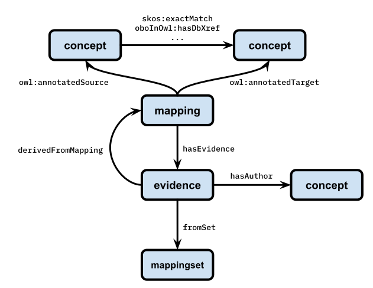

Querying with Cypher
====================

SeMRA constructs locally-deployable Neo4j graph databases that can be queried directly
with the `Cypher query language
<https://neo4j.com/docs/cypher-manual/current/introduction/>`_. By default, this works
by the Docker image exposing port 7687.

Alternatively, you can navigate to http://localhost:7474 for a graphical front-end to
Neo4j where you can type in Cypher queries and interact with the results.

In the following examples, we'll use the cell and cell lines database.

Data Model
----------

Lookup by CURIE
---------------

The following Cypher queries allow for looking up concepts, mappings, evidences, and
mapping sets in a Neo4j database output by SeMRA (using :func:`semra.write_neo4j`).

Look up a concept (e.g., a cell line) by its CURIE:

.. code-block:: cypher

    MATCH (n:concept)
    WHERE n.curie = "cellosaurus:0440"
    RETURN n

The same is possible for mappings, evidences, and mapping sets. Each of these three
types of entities has SeMRA-specific CURIE generation. For a mapping:

.. code-block:: cypher

    MATCH (m:mapping)
    WHERE m.curie = "..."
    RETURN m

For an evidence:

.. code-block:: cypher

    MATCH (e:evidence)
    WHERE e.curie = "..."
    RETURN e

For a mapping set:

.. code-block:: cypher

    MATCH (s:mappingset)
    WHERE s.curie = "..."
    RETURN s

Cypher also lets you return certain parts from each record. The list of what fields are
available can be found in the following documentation:

=========== ===============================================
Concept     :data:`semra.io.neo4j_io.CONCEPT_NODES_HEADER`
Mapping     :data:`semra.io.neo4j_io.MAPPING_NODES_HEADER`
Evidence    :data:`semra.io.neo4j_io.EVIDENCE_NODES_HEADER`
Mapping Set :data:`semra.io.neo4j_io.MAPPING_NODES_HEADER`
=========== ===============================================

For example, you can look up a concept by its CURIE and return specific parts, such as
the name:

.. code-block:: cypher

    MATCH (n:concept)
    WHERE n.curie = "cellosaurus:0440"
    RETURN n.name

Traversing Mappings
-------------------

Get all targets for exact match mappings where ``cellosaurus:0440`` is the source:

.. code-block:: cypher

    MATCH
        (source:concept)-[:`skos:exactMatch`]->(target:concept)
    WHERE source.curie = "cellosaurus:0440"
    RETURN target

The same query can be reified using ``owl:annotatedSource``, ``owl:annotatedTarget``,
and the ``mapping`` node type:

.. code-block:: cypher

    MATCH
        (m:mapping)-[:`owl:annotatedSource`]->(source:concept) ,
        (m)-[:`owl:annotatedSource`]->(target:concept)
    WHERE source.curie = "cellosaurus:0440" and m.predicate == "skos:exactMatch"
    RETURN target

After reifying, you can extend the query to return evidences. In the interactive view,
returning multiple elements will also automatically show edges between them

.. code-block:: cypher

    MATCH
        (m:mapping)-[:`owl:annotatedSource`]->(source:concept) ,
        (m)-[:`owl:annotatedSource`]->(target:concept)
        (m)-[:hasEvidence]->(e:evidence)
    WHERE source.curie = "cellosaurus:0440" and m.predicate == "skos:exactMatch"
    RETURN source, target, m, e

Reification is useful for doing complex filters, e.g., on mapping justification. The
following query returns exact matches to ``cellosaurus:0440`` that have manual mapping
justification

.. code-block:: cypher

    MATCH
        (m:mapping)-[:`owl:annotatedSource`]->(source:concept) ,
        (m)-[:`owl:annotatedSource`]->(target:concept)
        (m)-[:hasEvidence]->(e:evidence)
    WHERE
        source.curie = "cellosaurus:0440"
        and m.predicate == "skos:exactMatch"
        and e.mapping_justification == "semapv:ManualMappingCuration"
    RETURN target

The previous query can be reformulated to filter for minimum confidence:

.. code-block:: cypher

    MATCH
        (m:mapping)-[:`owl:annotatedSource`]->(source:concept) ,
        (m)-[:`owl:annotatedSource`]->(target:concept)
        (m)-[:hasEvidence]->(e:evidence)
    WHERE
        source.curie = "cellosaurus:0440"
        and m.predicate == "skos:exactMatch"
        and e.confidence > 0.3
    RETURN target

It can also be extended to return the authors of the evidences:

.. code-block:: cypher

    MATCH
        (m:mapping)-[:`owl:annotatedSource`]->(source:concept) ,
        (m)-[:`owl:annotatedSource`]->(target:concept)
        (m)-[:hasEvidence]->(e:evidence)
        (e)-[:hasAuthor]->(author:concept)
    WHERE
        source.curie = "cellosaurus:0440"
        and m.predicate == "skos:exactMatch"
        and e.mapping_justification == "semapv:ManualMappingCuration"
    RETURN target, author

The following query gets all mappings (with associated evidences, mapping sets, and
authors) where ``cellosaurus:0440`` is the source, with optional matches for mapping
sets and authors:

.. code-block:: cypher

    MATCH
        (m:mapping)-[:`owl:annotatedSource`]->(source:concept) ,
        (m:mapping)-[:`owl:annotatedTarget`]->(target:concept) ,
        (m)-[:hasEvidence]->(e:evidence)
    WHERE source.curie = "cellosaurus:0440"
    OPTIONAL MATCH
        (e)-[:fromSet]->(mset:mappingset)
    OPTIONAL MATCH
        (e)-[:hasAuthor]->(author:concept)
    RETURN source, target, m, e, mset, author

Neo4j Output Reference
----------------------

.. automodapi:: semra.io.neo4j_io
    :skip: write_neo4j
    :include-all-objects:
    :no-heading:
