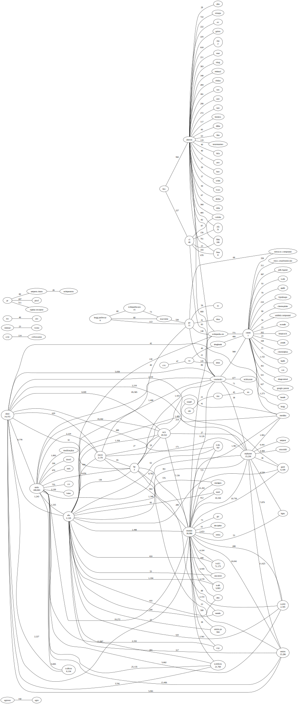
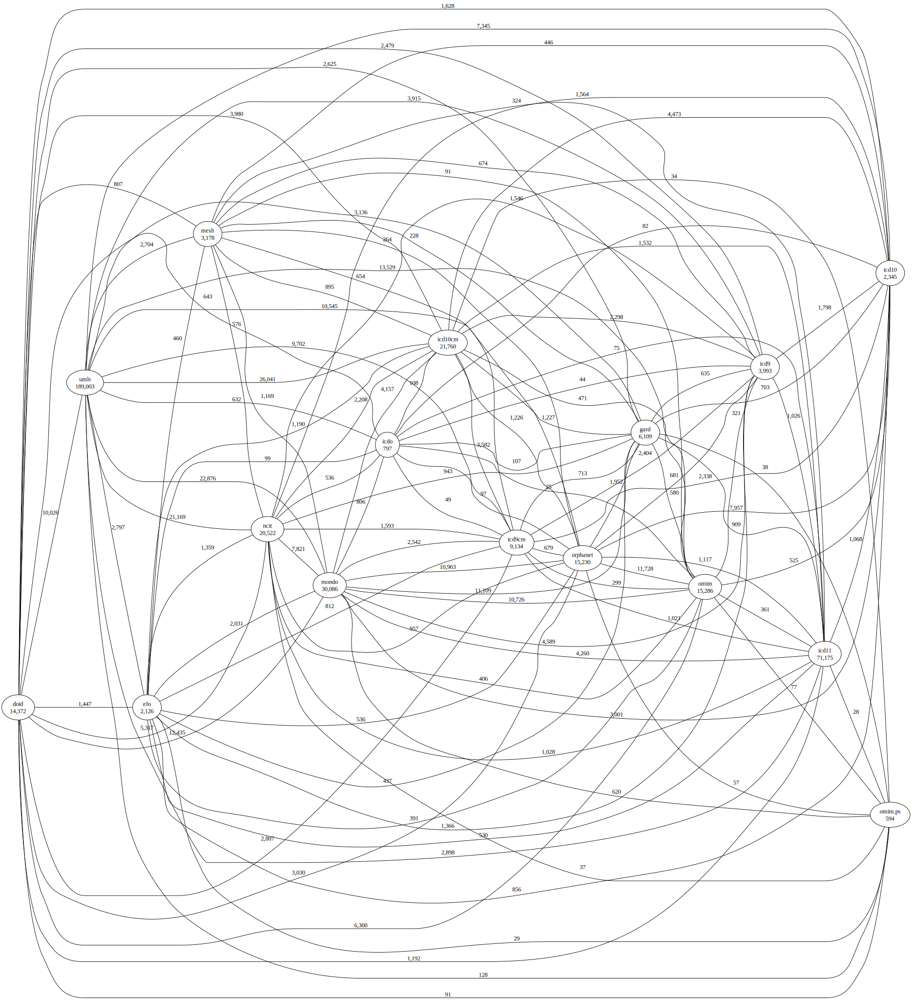
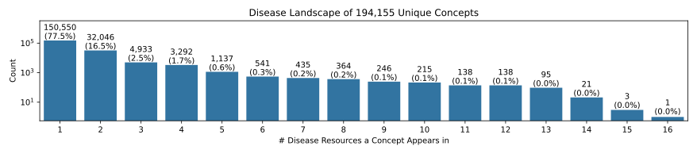

# SeMRA Disease Mappings Database

Supports the analysis of the landscape of disease nomenclature resources.
Created by:

<ul>
<li>
<a href="https://bioregistry.io/orcid:0000-0003-4423-4370">
Charles Tapley Hoyt (orcid:0000-0003-4423-4370)
</a>
</li>
</ul>

Artifacts from this resource can be downloaded from Zenodo at
[](https://doi.org/10.5281/zenodo.11091885).

## Reproduction

The SeMRA Disease Mappings Database can be rebuilt with the following commands:

```console
$ git clone https://github.com/biopragmatics/semra.git
$ cd semra
$ uv pip install .[landscape]
$ python -m semra.landscape.disease
```

Note that downloading raw data resources can take on the order of hours to tens
of hours depending on your internet connection and the reliability of the
resources' respective servers.

A full resource refresh (i.e., re-download of resources) was run in 2 hours on
commodity hardware (e.g., a 2023 MacBook Pro with 36GB RAM).

## Resource Summary

The following resources are represented in processed mappings generated. They
are summarized in the following table that includes their
[Bioregistry](https://bioregistry.io) prefix, license, current version, and
number of terms (i.e., named concepts) they contain.

2 resources were not available through
[PyOBO](https://github.com/biopragmatics/pyobo). Therefore, the number of terms
in that resource are estimated based on the ones that are observed in mappings
assembled by SeMRA. Note that these are typically an underestimate.

| prefix        | name                                                                             | license                                                                                                  | version    |  terms | status   |
| :------------ | :------------------------------------------------------------------------------- | :------------------------------------------------------------------------------------------------------- | :--------- | -----: | :------- |
| doid          | Human Disease Ontology                                                           | CC0-1.0                                                                                                  | 2025-06-27 |  14372 | full     |
| mondo         | Mondo Disease Ontology                                                           | CC-BY-4.0                                                                                                | 2025-06-03 |  30086 | full     |
| efo           | Experimental Factor Ontology                                                     | Apache-2.0                                                                                               | 3.79.0     |   2126 | subset   |
| mesh          | Medical Subject Headings                                                         | CC0-1.0                                                                                                  | 2025       |   3178 | subset   |
| ncit          | NCI Thesaurus                                                                    | CC-BY-4.0                                                                                                | 25.06e     |  20522 | subset   |
| orphanet      | Orphanet                                                                         | CC-BY-4.0                                                                                                |            |  15230 | observed |
| orphanet.ordo | Orphanet Rare Disease Ontology                                                   | CC-BY-4.0                                                                                                | 4.6        |  15590 | full     |
| umls          | Unified Medical Language System Concept Unique Identifier                        | https://www.nlm.nih.gov/research/umls/knowledge_sources/metathesaurus/release/license_agreement.html     | 2025AA     | 189003 | subset   |
| omim          | Online Mendelian Inheritance in Man                                              | https://www.omim.org/help/agreement                                                                      | 2025-07-02 |  15286 | observed |
| omim.ps       | OMIM Phenotypic Series                                                           | https://www.omim.org/help/agreement                                                                      | 2025-07-02 |    594 | full     |
| gard          | Genetic and Rare Diseases Information Center                                     |                                                                                                          |            |   6109 | full     |
| icd10         | International Classification of Diseases, 10th Revision                          | https://cdn.who.int/media/docs/default-source/publishing-policies/copyright/who-faq-licensing-icd-10.pdf | 2019       |   2345 | full     |
| icd10cm       | International Classification of Diseases, 10th Revision, Clinical Modification   |                                                                                                          |            |  21760 | observed |
| icd10pcs      | International Classification of Diseases, 10th Revision, Procedure Coding System |                                                                                                          |            |      0 | observed |
| icd11         | International Classification of Diseases, 11th Revision (Foundation Component)   | CC-BY-ND-3.0-IGO                                                                                         | 2025-01    |  71175 | full     |
| icd11.code    | ICD 11 Codes                                                                     | http://www.who.int/about/licensing/copyright_form/en                                                     |            |      0 | observed |
| icd9          | International Classification of Diseases, 9th Revision                           |                                                                                                          |            |   3993 | observed |
| icd9cm        | International Classification of Diseases, 9th Revision, Clinical Modification    |                                                                                                          |            |   9134 | observed |
| icdo          | International Classification of Diseases for Oncology                            |                                                                                                          |            |    797 | observed |

There are a total of 421,300 terms across the 19 resources.

## Mapping Summary and Usage

### Raw Mappings

The raw mappings are the ones directly read from the 9 sources.

- This table is symmetric, i.e., taking into account mappings from both the
  source and target.
- Diagonals represent the number of entities in the resource (or the number that
  are observed in the mappings, in some cases)
- All predicate types are combined in this table.

| source_prefix |  doid | mondo |  efo | mesh |  ncit | orphanet | orphanet.ordo |   umls |  omim | omim.ps |  gard | icd10 | icd10cm | icd10pcs | icd11 | icd11.code | icd9 | icd9cm | icdo |
| :------------ | ----: | ----: | ---: | ---: | ----: | -------: | ------------: | -----: | ----: | ------: | ----: | ----: | ------: | -------: | ----: | ---------: | ---: | -----: | ---: |
| doid          | 14372 | 11867 | 1243 |  629 |  4640 |     2219 |             0 |   6778 |  5901 |       0 |  2141 |     0 |    3541 |        0 |     2 |          0 |   11 |   2227 |  488 |
| mondo         | 11867 | 30086 | 1448 |  864 |  7150 |    10344 |             0 |  19272 | 10041 |     599 | 10730 |   208 |    2561 |        0 |  4164 |          0 | 4418 |      2 |  725 |
| efo           |  1243 |  1448 | 2126 |  434 |  1104 |      361 |             0 |   1335 |   317 |      23 |   289 |   525 |     293 |        0 |   410 |          0 | 1194 |      5 |   62 |
| mesh          |   629 |   864 |  434 | 3178 |    27 |      171 |             0 |   2124 |     0 |       0 |     0 |     0 |       0 |        0 |     0 |          0 |    0 |      0 |    0 |
| ncit          |  4640 |  7150 | 1104 |   27 | 20522 |       37 |             0 |  19442 |     0 |       0 |     0 |     0 |       0 |        0 |     0 |          0 |    0 |      0 |    0 |
| orphanet      |  2219 | 10344 |  361 |  171 |    37 |    15230 |             0 |   8782 | 11625 |       5 |    38 |  7879 |       0 |        0 |     1 |          0 |    5 |      0 |    1 |
| orphanet.ordo |     0 |     0 |    0 |    0 |     0 |        0 |         15590 |      0 |     0 |       0 |     0 |     0 |       0 |        0 |     0 |          0 |    0 |      0 |    0 |
| umls          |  6778 | 19272 | 1335 | 2124 | 19442 |     8782 |             0 | 189003 | 13406 |       0 |     0 |  5662 |   25135 |        0 |     0 |          0 |    0 |   9005 |    0 |
| omim          |  5901 | 10041 |  317 |    0 |     0 |    11625 |             0 |  13406 | 15286 |       0 |     0 |     0 |       0 |        0 |     0 |          0 |    0 |      0 |    0 |
| omim.ps       |     0 |   599 |   23 |    0 |     0 |        5 |             0 |      0 |     0 |     594 |     0 |     0 |       0 |        0 |     0 |          0 |    0 |      0 |    0 |
| gard          |  2141 | 10730 |  289 |    0 |     0 |       38 |             0 |      0 |     0 |       0 |  6109 |     0 |       0 |        0 |     0 |          0 |    0 |      0 |    0 |
| icd10         |     0 |   208 |  525 |    0 |     0 |     7879 |             0 |   5662 |     0 |       0 |     0 |  2345 |       0 |        0 |     0 |          0 |    0 |      0 |    0 |
| icd10cm       |  3541 |  2561 |  293 |    0 |     0 |        0 |             0 |  25135 |     0 |       0 |     0 |     0 |   21760 |        0 |     0 |          0 |    0 |      0 |    0 |
| icd10pcs      |     0 |     0 |    0 |    0 |     0 |        0 |             0 |      0 |     0 |       0 |     0 |     0 |       0 |        0 |     0 |          0 |    0 |      0 |    0 |
| icd11         |     2 |  4164 |  410 |    0 |     0 |        1 |             0 |      0 |     0 |       0 |     0 |     0 |       0 |        0 | 71175 |          0 |    0 |      0 |    0 |
| icd11.code    |     0 |     0 |    0 |    0 |     0 |        0 |             0 |      0 |     0 |       0 |     0 |     0 |       0 |        0 |     0 |          0 |    0 |      0 |    0 |
| icd9          |    11 |  4418 | 1194 |    0 |     0 |        5 |             0 |      0 |     0 |       0 |     0 |     0 |       0 |        0 |     0 |          0 | 3993 |      0 |    0 |
| icd9cm        |  2227 |     2 |    5 |    0 |     0 |        0 |             0 |   9005 |     0 |       0 |     0 |     0 |       0 |        0 |     0 |          0 |    0 |   9134 |    0 |
| icdo          |   488 |   725 |   62 |    0 |     0 |        1 |             0 |      0 |     0 |       0 |     0 |     0 |       0 |        0 |     0 |          0 |    0 |      0 |  797 |

The raw mappings can be downloaded from
[](https://doi.org/10.5281/zenodo.11091885).
then can be accessed via the [SeMRA](https://github.com/biopragmatics/semra)
Python Package using the following examples:

```python
import semra

# Load from JSONL
mappings_from_jsonl = semra.from_jsonl("raw.jsonl.gz")

# Load from SSSOM
mappings_from_sssom = semra.from_sssom("raw.sssom.tsv.gz")
```

<details>
<summary>Graph-based view of raw mappings</summary>

Note that this may contain many more prefixes than what's relevant for
processing. The configuration allows for specifying a prefix allowlist and
prefix blocklist.



</details>

### Processed Mappings

The processed mappings result from the application of inference, reasoning, and
confidence filtering. Before processing, only mappings with subjects and objects
whose references both use the following prefixes were retained:

<ul>
<li>doid</li>
<li>mondo</li>
<li>efo</li>
<li>mesh</li>
<li>ncit</li>
<li>orphanet</li>
<li>orphanet.ordo</li>
<li>umls</li>
<li>omim</li>
<li>omim.ps</li>
<li>gard</li>
<li>icd10</li>
<li>icd10cm</li>
<li>icd10pcs</li>
<li>icd11</li>
<li>icd11.code</li>
<li>icd9</li>
<li>icd9cm</li>
<li>icdo</li>
</ul>
The following prior knowledge was used during processing:

<table>
<thead>
<tr>
<th>Source Prefix</th>
<th>Target Prefix</th>
<th>Old Predicate</th>
<th>New Predicate</th>
<th align="right">Confidence</th>
</tr>
</thead>
<tbody>
<tr>
<td>doid</td>
<td>(all)</td>
<td>oboinowl:hasDbXref</td>
<td>skos:exactMatch</td>
<td align="right">0.95</td>
</tr>
<tr>
<td>mondo</td>
<td>(all)</td>
<td>oboinowl:hasDbXref</td>
<td>skos:exactMatch</td>
<td align="right">0.95</td>
</tr>
<tr>
<td>efo</td>
<td>(all)</td>
<td>oboinowl:hasDbXref</td>
<td>skos:exactMatch</td>
<td align="right">0.9</td>
</tr>
<tr>
<td>ncit</td>
<td>(all)</td>
<td>oboinowl:hasDbXref</td>
<td>skos:exactMatch</td>
<td align="right">0.7</td>
</tr>
<tr>
<td>umls</td>
<td>(all)</td>
<td>oboinowl:hasDbXref</td>
<td>skos:exactMatch</td>
<td align="right">0.7</td>
</tr>
<tr>
<td>orphanet.ordo</td>
<td>(all)</td>
<td>oboinowl:hasDbXref</td>
<td>skos:exactMatch</td>
<td align="right">0.7</td>
</tr>
<tr>
<td>orphanet</td>
<td>(all)</td>
<td>oboinowl:hasDbXref</td>
<td>skos:exactMatch</td>
<td align="right">0.7</td>
</tr>
</tbody>
</table>

The processed mappings table has the following qualities:

- This table is symmetric, i.e., taking into account mappings from the source,
  target, and inference
- Diagonals represent the number of entities in the resource (or the number that
  are observed in the mappings, in some cases)
- Only exact matches are retained

| source_prefix |  doid | mondo |  efo | mesh |  ncit | orphanet | orphanet.ordo |   umls |  omim | omim.ps |  gard | icd10 | icd10cm | icd10pcs | icd11 | icd11.code | icd9 | icd9cm | icdo |
| :------------ | ----: | ----: | ---: | ---: | ----: | -------: | ------------: | -----: | ----: | ------: | ----: | ----: | ------: | -------: | ----: | ---------: | ---: | -----: | ---: |
| doid          | 14372 | 12435 | 1447 |  807 |  5317 |     3030 |             0 |  10026 |  6300 |      91 |  2625 |  1628 |    3980 |        0 |  1192 |          0 | 2479 |   2807 |  643 |
| mondo         | 12435 | 30086 | 2031 | 1169 |  7821 |    10963 |             0 |  22876 | 10726 |     620 | 11109 |  3001 |    4157 |        0 |  4260 |          0 | 4589 |   2542 |  806 |
| efo           |  1447 |  2031 | 2126 |  460 |  1359 |      536 |             0 |   2797 |   391 |      29 |   437 |   856 |    1190 |        0 |   530 |          0 | 1366 |    812 |   99 |
| mesh          |   807 |  1169 |  460 | 3178 |   576 |      264 |             0 |   2704 |    91 |       4 |   228 |   446 |     895 |        0 |   324 |          0 |  674 |    654 |    4 |
| ncit          |  5317 |  7821 | 1359 |  576 | 20522 |      957 |             0 |  21169 |   406 |      37 |   943 |  1564 |    2208 |        0 |  1028 |          0 | 1546 |   1593 |  536 |
| orphanet      |  3030 | 10963 |  536 |  264 |   957 |    15230 |             0 |  10545 | 11728 |      57 |  1952 |  7957 |    1226 |        0 |  1117 |          0 |  681 |    679 |   97 |
| orphanet.ordo |     0 |     0 |    0 |    0 |     0 |        0 |         15590 |      0 |     0 |       0 |     0 |     0 |       0 |        0 |     0 |          0 |    0 |      0 |    0 |
| umls          | 10026 | 22876 | 2797 | 2704 | 21169 |    10545 |             0 | 189003 | 13529 |     128 |  3136 |  7345 |   26041 |        0 |  2898 |          0 | 3915 |   9702 |  632 |
| omim          |  6300 | 10726 |  391 |   91 |   406 |    11728 |             0 |  13529 | 15286 |      77 |   580 |   525 |     471 |        0 |   361 |          0 |  321 |    299 |   25 |
| omim.ps       |    91 |   620 |   29 |    4 |    37 |       57 |             0 |    128 |    77 |     594 |    38 |    20 |      34 |        0 |    28 |          0 |   15 |     18 |    0 |
| gard          |  2625 | 11109 |  437 |  228 |   943 |     1952 |             0 |   3136 |   580 |      38 |  6109 |   703 |    1227 |        0 |   909 |          0 |  635 |    713 |  107 |
| icd10         |  1628 |  3001 |  856 |  446 |  1564 |     7957 |             0 |   7345 |   525 |      20 |   703 |  2345 |    4473 |        0 |  1068 |          0 | 1798 |   2338 |   82 |
| icd10cm       |  3980 |  4157 | 1190 |  895 |  2208 |     1226 |             0 |  26041 |   471 |      34 |  1227 |  4473 |   21760 |        0 |  1532 |          0 | 2298 |   3582 |  108 |
| icd10pcs      |     0 |     0 |    0 |    0 |     0 |        0 |             0 |      0 |     0 |       0 |     0 |     0 |       0 |        0 |     0 |          0 |    0 |      0 |    0 |
| icd11         |  1192 |  4260 |  530 |  324 |  1028 |     1117 |             0 |   2898 |   361 |      28 |   909 |  1068 |    1532 |        0 | 71175 |          0 | 1026 |   1021 |   75 |
| icd11.code    |     0 |     0 |    0 |    0 |     0 |        0 |             0 |      0 |     0 |       0 |     0 |     0 |       0 |        0 |     0 |          0 |    0 |      0 |    0 |
| icd9          |  2479 |  4589 | 1366 |  674 |  1546 |      681 |             0 |   3915 |   321 |      15 |   635 |  1798 |    2298 |        0 |  1026 |          0 | 3993 |   2404 |   44 |
| icd9cm        |  2807 |  2542 |  812 |  654 |  1593 |      679 |             0 |   9702 |   299 |      18 |   713 |  2338 |    3582 |        0 |  1021 |          0 | 2404 |   9134 |   49 |
| icdo          |   643 |   806 |   99 |    4 |   536 |       97 |             0 |    632 |    25 |       0 |   107 |    82 |     108 |        0 |    75 |          0 |   44 |     49 |  797 |

The processed mappings can be downloaded from
[](https://doi.org/10.5281/zenodo.11091885).
then can be accessed via the [SeMRA](https://github.com/biopragmatics/semra)
Python Package using the following examples:

```python
import semra

# Load from JSONL
mappings_from_jsonl = semra.from_jsonl("processed.jsonl.gz")

# Load from SSSOM
mappings_from_sssom = semra.from_sssom("processed.sssom.tsv.gz")
```

Below is a graph-based view on the processed mappings.



### Priority Mappings

A prioritization mapping is a special subset of processed mappings constructed
using the prefix priority list. This mapping has the feature that every entity
appears as a subject exactly once, with the object of its mapping being the
priority entity. This creates a "star graph" for each priority entity.

The prioritization for this output is:

<ol>
<li><a href="https://bioregistry.io/doid">Human Disease Ontology (<code>doid</code>)</a></li>
<li><a href="https://bioregistry.io/mondo">Mondo Disease Ontology (<code>mondo</code>)</a></li>
<li><a href="https://bioregistry.io/efo">Experimental Factor Ontology (<code>efo</code>)</a></li>
<li><a href="https://bioregistry.io/mesh">Medical Subject Headings (<code>mesh</code>)</a></li>
<li><a href="https://bioregistry.io/ncit">NCI Thesaurus (<code>ncit</code>)</a></li>
<li><a href="https://bioregistry.io/orphanet">Orphanet (<code>orphanet</code>)</a></li>
<li><a href="https://bioregistry.io/orphanet.ordo">Orphanet Rare Disease Ontology (<code>orphanet.ordo</code>)</a></li>
<li><a href="https://bioregistry.io/umls">Unified Medical Language System Concept Unique Identifier (<code>umls</code>)</a></li>
<li><a href="https://bioregistry.io/omim">Online Mendelian Inheritance in Man (<code>omim</code>)</a></li>
<li><a href="https://bioregistry.io/omim.ps">OMIM Phenotypic Series (<code>omim.ps</code>)</a></li>
<li><a href="https://bioregistry.io/gard">Genetic and Rare Diseases Information Center (<code>gard</code>)</a></li>
<li><a href="https://bioregistry.io/icd10">International Classification of Diseases, 10th Revision (<code>icd10</code>)</a></li>
<li><a href="https://bioregistry.io/icd10cm">International Classification of Diseases, 10th Revision, Clinical Modification (<code>icd10cm</code>)</a></li>
<li><a href="https://bioregistry.io/icd10pcs">International Classification of Diseases, 10th Revision, Procedure Coding System (<code>icd10pcs</code>)</a></li>
<li><a href="https://bioregistry.io/icd11">International Classification of Diseases, 11th Revision (Foundation Component) (<code>icd11</code>)</a></li>
<li><a href="https://bioregistry.io/icd11.code">ICD 11 Codes (<code>icd11.code</code>)</a></li>
<li><a href="https://bioregistry.io/icd9">International Classification of Diseases, 9th Revision (<code>icd9</code>)</a></li>
<li><a href="https://bioregistry.io/icd9cm">International Classification of Diseases, 9th Revision, Clinical Modification (<code>icd9cm</code>)</a></li>
<li><a href="https://bioregistry.io/icdo">International Classification of Diseases for Oncology (<code>icdo</code>)</a></li>
</ol>

The priority mappings can be downloaded from
[](https://doi.org/10.5281/zenodo.11091885).
then can be accessed via the [SeMRA](https://github.com/biopragmatics/semra)
Python Package using the following examples:

```python
import semra
import semra.api

# Load from JSONL
mappings_from_jsonl = semra.from_jsonl("priority.jsonl.gz")

# Load from SSSOM
mappings_from_sssom = semra.from_sssom("priority.sssom.tsv.gz")

# Apply in a data science scenario
df = ...
semra.api.prioritize_df(mappings_from_jsonl, df, column="source_column_id", target_column="target_column_id")
```

## Web Application

1. Download all artifacts from
   [](https://doi.org/10.5281/zenodo.11091885)
   into a folder and `cd` into it
2. Run `sh run_on_docker.sh` from the command line
3. Navigate to http://localhost:8773 to see the SeMRA dashboard or to
   http://localhost:7474 for direct access to the Neo4j graph database

## Analyses

### Comparison Analysis

The following comparison shows the absolute number of mappings added by
processing/inference. Across the board, this process adds large numbers of
mappings to most resources, especially ones that were previously only connected
to a small number of other resources.

| source_prefix | doid | mondo |  efo | mesh | ncit | orphanet | orphanet.ordo | umls | omim | omim.ps | gard | icd10 | icd10cm | icd10pcs | icd11 | icd11.code | icd9 | icd9cm | icdo |
| :------------ | ---: | ----: | ---: | ---: | ---: | -------: | ------------: | ---: | ---: | ------: | ---: | ----: | ------: | -------: | ----: | ---------: | ---: | -----: | ---: |
| doid          |    0 |   568 |  204 |  178 |  677 |      811 |             0 | 3248 |  399 |      91 |  484 |  1628 |     439 |        0 |  1190 |          0 | 2468 |    580 |  155 |
| mondo         |  568 |     0 |  583 |  305 |  671 |      619 |             0 | 3604 |  685 |      21 |  379 |  2793 |    1596 |        0 |    96 |          0 |  171 |   2540 |   81 |
| efo           |  204 |   583 |    0 |   26 |  255 |      175 |             0 | 1462 |   74 |       6 |  148 |   331 |     897 |        0 |   120 |          0 |  172 |    807 |   37 |
| mesh          |  178 |   305 |   26 |    0 |  549 |       93 |             0 |  580 |   91 |       4 |  228 |   446 |     895 |        0 |   324 |          0 |  674 |    654 |    4 |
| ncit          |  677 |   671 |  255 |  549 |    0 |      920 |             0 | 1727 |  406 |      37 |  943 |  1564 |    2208 |        0 |  1028 |          0 | 1546 |   1593 |  536 |
| orphanet      |  811 |   619 |  175 |   93 |  920 |        0 |             0 | 1763 |  103 |      52 | 1914 |    78 |    1226 |        0 |  1116 |          0 |  676 |    679 |   96 |
| orphanet.ordo |    0 |     0 |    0 |    0 |    0 |        0 |             0 |    0 |    0 |       0 |    0 |     0 |       0 |        0 |     0 |          0 |    0 |      0 |    0 |
| umls          | 3248 |  3604 | 1462 |  580 | 1727 |     1763 |             0 |    0 |  123 |     128 | 3136 |  1683 |     906 |        0 |  2898 |          0 | 3915 |    697 |  632 |
| omim          |  399 |   685 |   74 |   91 |  406 |      103 |             0 |  123 |    0 |      77 |  580 |   525 |     471 |        0 |   361 |          0 |  321 |    299 |   25 |
| omim.ps       |   91 |    21 |    6 |    4 |   37 |       52 |             0 |  128 |   77 |       0 |   38 |    20 |      34 |        0 |    28 |          0 |   15 |     18 |    0 |
| gard          |  484 |   379 |  148 |  228 |  943 |     1914 |             0 | 3136 |  580 |      38 |    0 |   703 |    1227 |        0 |   909 |          0 |  635 |    713 |  107 |
| icd10         | 1628 |  2793 |  331 |  446 | 1564 |       78 |             0 | 1683 |  525 |      20 |  703 |     0 |    4473 |        0 |  1068 |          0 | 1798 |   2338 |   82 |
| icd10cm       |  439 |  1596 |  897 |  895 | 2208 |     1226 |             0 |  906 |  471 |      34 | 1227 |  4473 |       0 |        0 |  1532 |          0 | 2298 |   3582 |  108 |
| icd10pcs      |    0 |     0 |    0 |    0 |    0 |        0 |             0 |    0 |    0 |       0 |    0 |     0 |       0 |        0 |     0 |          0 |    0 |      0 |    0 |
| icd11         | 1190 |    96 |  120 |  324 | 1028 |     1116 |             0 | 2898 |  361 |      28 |  909 |  1068 |    1532 |        0 |     0 |          0 | 1026 |   1021 |   75 |
| icd11.code    |    0 |     0 |    0 |    0 |    0 |        0 |             0 |    0 |    0 |       0 |    0 |     0 |       0 |        0 |     0 |          0 |    0 |      0 |    0 |
| icd9          | 2468 |   171 |  172 |  674 | 1546 |      676 |             0 | 3915 |  321 |      15 |  635 |  1798 |    2298 |        0 |  1026 |          0 |    0 |   2404 |   44 |
| icd9cm        |  580 |  2540 |  807 |  654 | 1593 |      679 |             0 |  697 |  299 |      18 |  713 |  2338 |    3582 |        0 |  1021 |          0 | 2404 |      0 |   49 |
| icdo          |  155 |    81 |   37 |    4 |  536 |       96 |             0 |  632 |   25 |       0 |  107 |    82 |     108 |        0 |    75 |          0 |   44 |     49 |    0 |

Here's an alternative view on the number of mappings normalized to show
percentage gain. Note that:

- `inf` means that there were no mappings before and now there are a non-zero
  number of mappings
- `NaN` means there were no mappings before inference and continue to be no
  mappings after inference

| source_prefix |    doid |  mondo |   efo |   mesh |   ncit | orphanet | orphanet.ordo |  umls | omim | omim.ps |   gard |  icd10 | icd10cm | icd10pcs |  icd11 | icd11.code |    icd9 | icd9cm | icdo |
| :------------ | ------: | -----: | ----: | -----: | -----: | -------: | ------------: | ----: | ---: | ------: | -----: | -----: | ------: | -------: | -----: | ---------: | ------: | -----: | ---: |
| doid          |       0 |    4.8 |  16.4 |   28.3 |   14.6 |     36.5 |           nan |  47.9 |  6.8 |     inf |   22.6 |    inf |    12.4 |      nan |  59500 |        nan | 22436.4 |     26 | 31.8 |
| mondo         |     4.8 |      0 |  40.3 |   35.3 |    9.4 |        6 |           nan |  18.7 |  6.8 |     3.5 |    3.5 | 1342.8 |    62.3 |      nan |    2.3 |        nan |     3.9 | 127000 | 11.2 |
| efo           |    16.4 |   40.3 |     0 |      6 |   23.1 |     48.5 |           nan | 109.5 | 23.3 |    26.1 |   51.2 |     63 |   306.1 |      nan |   29.3 |        nan |    14.4 |  16140 | 59.7 |
| mesh          |    28.3 |   35.3 |     6 |      0 | 2033.3 |     54.4 |           nan |  27.3 |  inf |     inf |    inf |    inf |     inf |      nan |    inf |        nan |     inf |    inf |  inf |
| ncit          |    14.6 |    9.4 |  23.1 | 2033.3 |      0 |   2486.5 |           nan |   8.9 |  inf |     inf |    inf |    inf |     inf |      nan |    inf |        nan |     inf |    inf |  inf |
| orphanet      |    36.5 |      6 |  48.5 |   54.4 | 2486.5 |        0 |           nan |  20.1 |  0.9 |    1040 | 5036.8 |      1 |     inf |      nan | 111600 |        nan |   13520 |    inf | 9600 |
| orphanet.ordo |     nan |    nan |   nan |    nan |    nan |      nan |             0 |   nan |  nan |     nan |    nan |    nan |     nan |      nan |    nan |        nan |     nan |    nan |  nan |
| umls          |    47.9 |   18.7 | 109.5 |   27.3 |    8.9 |     20.1 |           nan |     0 |  0.9 |     inf |    inf |   29.7 |     3.6 |      nan |    inf |        nan |     inf |    7.7 |  inf |
| omim          |     6.8 |    6.8 |  23.3 |    inf |    inf |      0.9 |           nan |   0.9 |    0 |     inf |    inf |    inf |     inf |      nan |    inf |        nan |     inf |    inf |  inf |
| omim.ps       |     inf |    3.5 |  26.1 |    inf |    inf |     1040 |           nan |   inf |  inf |       0 |    inf |    inf |     inf |      nan |    inf |        nan |     inf |    inf |  nan |
| gard          |    22.6 |    3.5 |  51.2 |    inf |    inf |   5036.8 |           nan |   inf |  inf |     inf |      0 |    inf |     inf |      nan |    inf |        nan |     inf |    inf |  inf |
| icd10         |     inf | 1342.8 |    63 |    inf |    inf |        1 |           nan |  29.7 |  inf |     inf |    inf |      0 |     inf |      nan |    inf |        nan |     inf |    inf |  inf |
| icd10cm       |    12.4 |   62.3 | 306.1 |    inf |    inf |      inf |           nan |   3.6 |  inf |     inf |    inf |    inf |       0 |      nan |    inf |        nan |     inf |    inf |  inf |
| icd10pcs      |     nan |    nan |   nan |    nan |    nan |      nan |           nan |   nan |  nan |     nan |    nan |    nan |     nan |      nan |    nan |        nan |     nan |    nan |  nan |
| icd11         |   59500 |    2.3 |  29.3 |    inf |    inf |   111600 |           nan |   inf |  inf |     inf |    inf |    inf |     inf |      nan |      0 |        nan |     inf |    inf |  inf |
| icd11.code    |     nan |    nan |   nan |    nan |    nan |      nan |           nan |   nan |  nan |     nan |    nan |    nan |     nan |      nan |    nan |        nan |     nan |    nan |  nan |
| icd9          | 22436.4 |    3.9 |  14.4 |    inf |    inf |    13520 |           nan |   inf |  inf |     inf |    inf |    inf |     inf |      nan |    inf |        nan |       0 |    inf |  inf |
| icd9cm        |      26 | 127000 | 16140 |    inf |    inf |      inf |           nan |   7.7 |  inf |     inf |    inf |    inf |     inf |      nan |    inf |        nan |     inf |      0 |  inf |
| icdo          |    31.8 |   11.2 |  59.7 |    inf |    inf |     9600 |           nan |   inf |  inf |     nan |    inf |    inf |     inf |      nan |    inf |        nan |     inf |    inf |    0 |

### Landscape Analysis

Above, the comparison looked at the overlaps between each resource. Now, that
information is used to jointly estimate the number of terms in the landscape
itself, and estimate how much of the landscape each resource covers.

This estimates a total of 194,155 unique entities.

- 43,605 (22.5%) have at least one mapping.
- 150,550 (77.5%) are unique to a single resource.
- 0 (0.0%) appear in all 19 resources.

This estimate is susceptible to several caveats:

- Missing mappings inflates this measurement
- Generic resources like MeSH contain irrelevant entities that can't be mapped

Because there are 19 prefixes, there are 524,287 possible overlaps to consider.
Therefore, a Venn diagram is not possible, so an
[UpSet plot](https://www.ncbi.nlm.nih.gov/pmc/articles/PMC4720993) (Lex _et
al._, 2014) is used as a high-dimensional Venn diagram.


Next, the mappings are aggregated to estimate the number of unique entities and
number that appear in each group of resources.



The landscape of 19 resources has 421,300 total terms. After merging redundant
nodes based on mappings, inference, and reasoning, there are 194,155 unique
concepts. Using the reduction formula
$\frac{{\text{{total terms}} - \text{{reduced terms}}}}{{\text{{total terms}}}}$,
this is a 53.92% reduction.

This is only an estimate and is susceptible to a few things:

1. It can be artificially high because there are entities that _should_ be
   mapped, but are not
1. It can be artificially low because there are entities that are incorrectly
   mapped, e.g., as a result of inference. The frontend curation interface can
   help identify and remove these
1. It can be artificially low because for some vocabularies like SNOMED-CT, it's
   not possible to load a terms list, and therefore it's not possible to account
   for terms that aren't mapped. Therefore, a lower bound estimate is made based
   on the terms that appear in mappings.
1. It can be artificially high if a vocabulary is used that covers many domains
   and is not properly subset'd. For example, EFO covers many different domains,
   so when doing disease landscape analysis, it should be subset to only terms
   in the disease hierarchy (i.e., appearing under `efo:0000408`).
1. It can be affected by terminology issues, such as the confusion between
   Orphanet and ORDO
1. It can be affected by the existence of many-to-many mappings, which are
   filtered out during processing, which makes the estimate artificially high
   since some subset of those entities could be mapped, but it's not clear which
   should.

## Licensing

Mappings are licensed according to their primary resources. These are explicitly
annotated in the SSSOM file on each row (when available) and on the mapping set
level in the Neo4j graph database artifacts. All original mappings produced by
SeMRA are licensed under CC0-1.0.
