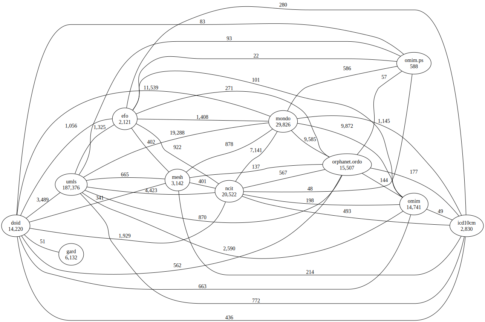
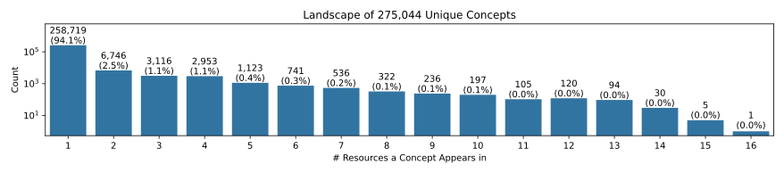

# Landscape Analysis

This folder contains results from a workflow for automating the analysis of the
landscape of a given domain, given a declarative configuration describing the
resources in that domain. It includes five landscape analyses:

1. [Disease](disease/disease-landscape.ipynb)
2. [Cell & Cell Line](cell/cell-landscape.ipynb)
3. [Anatomy](anatomy/anatomy-landscape.ipynb)
4. [Protein Complex](complex/complex-landscape.ipynb)
5. [Gene](gene/gene-landscape.ipynb)

## Example

Below, we highlight the disease landscape. Each analysis creates a graph of the
processed mappings.



We're able to automatically generate an UpSet plot like the one in
[How many rare diseases are there? (Haendel _et al._, 2020)](https://doi.org/10.1038/d41573-019-00180-y)
(a similar plot to the following appears in the
[supplementary info](https://media.nature.com/original/magazine-assets/d41573-019-00180-y/17308594)
and an explanation appears on [zenodo](https://zenodo.org/records/3478576)).
Note that our plot is about all diseases, not specifically rare ones:


The following histogram estimates how many diseases there are. Importantly, it
shows how many show up in a single resource, how many show up in all resources,
and how many show up in a few



## Summary

A summary chart over all landscapes can be generated with `landscape.py`.

| Domain  | Raw Concepts | Unique Concepts | Reduction Ratio | Download Link                                 |
| :------ | -----------: | --------------: | --------------: | :-------------------------------------------- |
| Disease |      377,250 |         275,044 |           27.1% | https://bioregistry.io/zenodo.record:11091886 |
| Anatomy |       39,362 |          33,877 |           13.9% | https://bioregistry.io/zenodo.record:11091803 |
| Complex |       17,932 |           9,011 |           49.7% | https://bioregistry.io/zenodo.record:11091422 |
| Gene    |   58,382,593 |      57,660,624 |            1.2% | https://bioregistry.io/zenodo.record:11092013 |
| Cell    |      218,557 |         172,299 |           21.2% | https://bioregistry.io/zenodo.record:11091581 |

## Rebuild

Run all notebooks after installing semra with the `landscape-notebook` extra,
then running the following:

```console
$ git clone https://github.com/biopragmatics/semra.git
$ cd semra
$ uv pip install .[landscape-notebooks]
$ cd notebooks/landscape
$ sh run.sh
$ python landscape.py
```

`landscape.py` quickly compiles the statistics into a markdown (for the summary
table above) and latex-ready string (for the manuscript)
