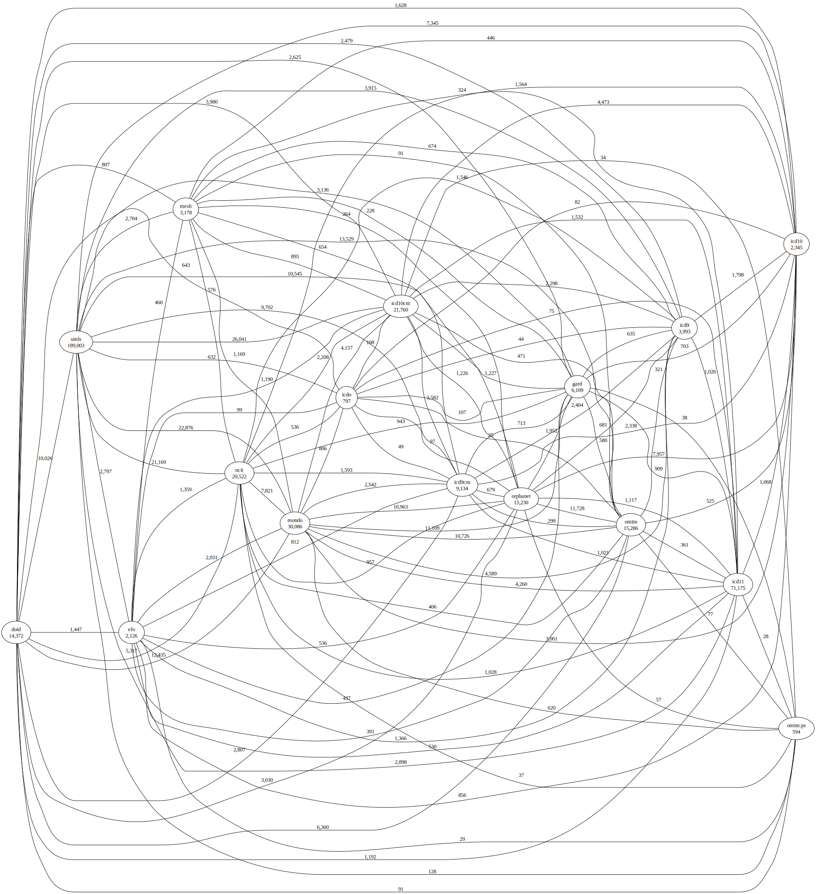
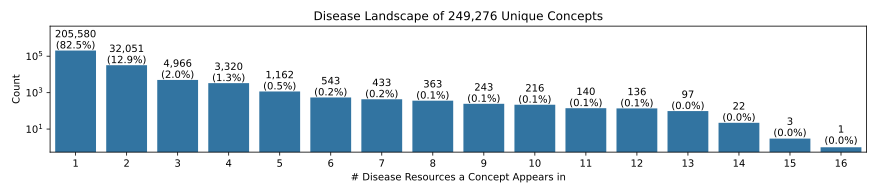

# Landscape Analysis

This folder contains results from a workflow for automating the analysis of the
landscape of a given domain, given a declarative configuration describing the
resources in that domain. It includes 5 landscape analyses:

<ol>
<li><a href="disease/">Disease</a></li>
<li><a href="cell/">Cell and Cell Line</a></li>
<li><a href="anatomy/">Anatomy</a></li>
<li><a href="complex/">Protein Complex</a></li>
<li><a href="gene/">Gene</a></li>
</ol>

## Example

The example below highlights the disease landscape. Each analysis creates a
graph of the processed mappings.



SeMRA automatically generates an UpSet plot like the one in
[How many rare diseases are there? (Haendel _et al._, 2020)](https://doi.org/10.1038/d41573-019-00180-y)
(a similar plot to the following appears in the
[supplementary info](https://media.nature.com/original/magazine-assets/d41573-019-00180-y/17308594)
and an explanation appears on [zenodo](https://zenodo.org/records/3478576)).
Note that this plot is about all diseases, not specifically rare ones:


The following histogram estimates how many diseases there are. Importantly, it
shows how many show up in a single resource, how many show up in all resources,
and how many show up in a few



## Summary

The summary table over all landscapes can be generated with `semra landscape`.

| Domain             | Raw Concepts | Unique Concepts | Reduction Ratio | Download Link                                 |
| :----------------- | -----------: | --------------: | --------------: | :-------------------------------------------- |
| Disease            |      421,026 |         194,344 |           53.8% | https://bioregistry.io/zenodo.record:11091886 |
| Cell and Cell Line |      223,688 |          44,114 |           80.3% | https://bioregistry.io/zenodo.record:11091581 |
| Anatomy            |       39,444 |          18,067 |           54.2% | https://bioregistry.io/zenodo.record:11091803 |
| Protein Complex    |       61,899 |           8,475 |           86.3% | https://bioregistry.io/zenodo.record:11091422 |
| Gene               |   58,346,471 |      57,624,180 |            1.2% | https://bioregistry.io/zenodo.record:11092013 |

## Rebuild

The `semra landscape` command rebuilds all landscape mapping files, calculates
summary statistics, and regenerates this file. It can be run with:

```console
$ git clone https://github.com/biopragmatics/semra.git
$ cd semra
$ uv pip install .[landscape]
$ semra landscape
```

To start off clean, use `--refresh-source` to re-download and re-parse resources
from scratch.

This script also outputs a LaTeX-ready string for the SeMRA manuscript.
