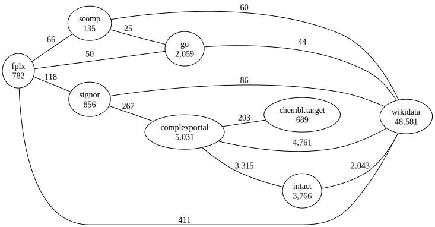

# SeMRA Protein Complex Landscape Analysis

Analyze the landscape of protein complex nomenclature resources, species-agnostic.

## Resource Summary

We summarize the resources used in the landscape analysis, including their
[Bioregistry](https://bioregistry.io) prefix, license, current version, and
number of terms (i.e., named concepts) they contain.


| prefix        | name                                | license      | version    |   terms | status   |
|:--------------|:------------------------------------|:-------------|:-----------|--------:|:---------|
| complexportal | Complex Portal                      | CC0-1.0      | 2025-03-28 |    5031 | full     |
| fplx          | FamPlex                             | CC0-1.0      |            |     782 | full     |
| go            | Gene Ontology                       | CC-BY-4.0    | 2025-03-16 |    2059 | subset   |
| chembl.target | ChEMBL target                       | CC-BY-SA-3.0 | 35         |     689 | subset   |
| wikidata      | Wikidata                            | CC0-1.0      |            |       0 | observed |
| scomp         | Selventa Complexes                  | Apache-2.0   |            |     135 | full     |
| signor        | Signaling Network Open Resource     | CC-BY-NC-4.0 | 2025-04-01 |     856 | full     |
| intact        | IntAct protein interaction database | CC-BY-4.0    | 2025-03-28 |       0 | observed |

There are a total of 2 terms across
the 8 resources.

## Raw Mapping Summary

The raw mappings are the ones directly read from the 9 sources.

- This table is symmetric, i.e., taking into account mappings from both the source and target.
- Diagonals represent the number of entities in the resource (or the number that are observed
  in the mappings, in some cases)
- All predicate types are combined in this table.

| source_prefix   |   complexportal |   fplx |   go |   chembl.target |   wikidata |   scomp |   signor |   intact |
|:----------------|----------------:|-------:|-----:|----------------:|-----------:|--------:|---------:|---------:|
| complexportal   |            5031 |      5 |    0 |             203 |       4759 |       0 |      267 |     3325 |
| fplx            |               5 |    782 |   46 |               0 |          0 |      66 |      118 |        0 |
| go              |               0 |     46 | 2059 |               0 |          0 |       0 |        0 |        3 |
| chembl.target   |             203 |      0 |    0 |             689 |          0 |       0 |        0 |        0 |
| wikidata        |            4759 |      0 |    0 |               0 |          0 |       0 |        0 |        0 |
| scomp           |               0 |     66 |    0 |               0 |          0 |     135 |        0 |        0 |
| signor          |             267 |    118 |    0 |               0 |          0 |       0 |      856 |        0 |
| intact          |            3325 |      0 |    3 |               0 |          0 |       0 |        0 |        0 |

## Processed Mapping Summary

The processed mappings result from the application of inference, reasoning, and confidence
filtering.

| source_prefix   |   complexportal |   fplx |   go |   chembl.target |   wikidata |   scomp |   signor |   intact |
|:----------------|----------------:|-------:|-----:|----------------:|-----------:|--------:|---------:|---------:|
| complexportal   |            5031 |      7 |    2 |             203 |       4761 |       2 |      267 |     3325 |
| fplx            |               7 |    782 |   50 |               0 |        411 |      66 |      118 |        5 |
| go              |               2 |     50 | 2059 |               0 |         43 |      25 |       11 |        5 |
| chembl.target   |             203 |      0 |    0 |             689 |          0 |       0 |        0 |        0 |
| wikidata        |            4761 |    411 |   43 |               0 |          0 |      60 |       86 |     2043 |
| scomp           |               2 |     66 |   25 |               0 |         60 |     135 |       14 |        2 |
| signor          |             267 |    118 |   11 |               0 |         86 |      14 |      856 |        0 |
| intact          |            3325 |      5 |    5 |               0 |       2043 |       2 |        0 |        0 |

Below is a graph-based view on the processed mappings.



## Comparison

The following comparison shows the absolute number of mappings added by processing/inference.
Across the board, this process adds large numbers of mappings to most resources, especially
ones that were previously only connected to a small number of other resources.

| source_prefix   |   complexportal |   fplx |   go |   chembl.target |   wikidata |   scomp |   signor |   intact |
|:----------------|----------------:|-------:|-----:|----------------:|-----------:|--------:|---------:|---------:|
| complexportal   |               0 |      2 |    2 |               0 |          2 |       2 |        0 |        0 |
| fplx            |               2 |      0 |    4 |               0 |        411 |       0 |        0 |        5 |
| go              |               2 |      4 |    0 |               0 |         43 |      25 |       11 |        2 |
| chembl.target   |               0 |      0 |    0 |               0 |          0 |       0 |        0 |        0 |
| wikidata        |               2 |    411 |   43 |               0 |          0 |      60 |       86 |     2043 |
| scomp           |               2 |      0 |   25 |               0 |         60 |       0 |       14 |        2 |
| signor          |               0 |      0 |   11 |               0 |         86 |      14 |        0 |        0 |
| intact          |               0 |      5 |    2 |               0 |       2043 |       2 |        0 |        0 |

Here's an alternative view on the number of mappings normalized to show percentage gain. Note that:

- `inf` means that there were no mappings before and now there are a non-zero number of
  mappings
- `NaN` means there were no mappings before inference and continue to be no mappings after
  inference

| source_prefix   |   complexportal |   fplx |    go |   chembl.target |   wikidata |   scomp |   signor |   intact |
|:----------------|----------------:|-------:|------:|----------------:|-----------:|--------:|---------:|---------:|
| complexportal   |               0 |   40   | inf   |               0 |          0 |     inf |        0 |      0   |
| fplx            |              40 |    0   |   8.7 |             nan |        inf |       0 |        0 |    inf   |
| go              |             inf |    8.7 |   0   |             nan |        inf |     inf |      inf |     66.7 |
| chembl.target   |               0 |  nan   | nan   |               0 |        nan |     nan |      nan |    nan   |
| wikidata        |               0 |  inf   | inf   |             nan |        nan |     inf |      inf |    inf   |
| scomp           |             inf |    0   | inf   |             nan |        inf |       0 |      inf |    inf   |
| signor          |               0 |    0   | inf   |             nan |        inf |     inf |        0 |    nan   |
| intact          |               0 |  inf   |  66.7 |             nan |        inf |     inf |      nan |    nan   |

## Landscape Analysis

Before, we looked at the overlaps between each resource. Now, we use that information
jointly to estimate the number of terms in the landscape itself, and estimate how much
of the landscape each resource covers.

This estimates a total of 9,121 unique entities.

- 5,278
  (57.9%) have
  at least one mapping.
- 3,843 (42.1%)
  are unique to a single resource.
- 0 (0.0%)
  appear in all 8 resources.

This estimate is susceptible to several caveats:

- Missing mappings inflates this measurement
- Generic resources like MeSH contain irrelevant entities that can't be mapped

Because there are 8 prefixes,
there are 255 possible overlaps to consider.
Therefore, a Venn diagram is not possible, so
we use an [UpSet plot](https://www.ncbi.nlm.nih.gov/pmc/articles/PMC4720993)
(Lex *et al.*, 2014) as a high-dimensional Venn diagram.


We now aggregate the mappings together to estimate the number of unique entities and number
that appear in each group of resources.


The landscape of 8 resources has
9,552 total terms.
After merging redundant nodes based on mappings, inference, and reasoning, there
are 9,121 unique concepts. Using the reduction formula
$\frac{{\text{{total terms}} - \text{{reduced terms}}}}{{\text{{total terms}}}}$,
this is a 4.51% reduction.

This is only an estimate and is susceptible to a few things:

1. It can be artificially high because there are entities that _should_ be mapped, but are not
2. It can be artificially low because there are entities that are incorrectly mapped, e.g., as
   a result of inference. The frontend curation interface can help identify and remove these
3. It can be artificially low because for some vocabularies like SNOMED-CT, it's not possible
   to load a terms list, and therefore it's not possible to account for terms that aren't
   mapped. Therefore, we make a lower bound estimate based on the terms that appear in
   mappings.
4. It can be artificially high if a vocabulary is used that covers many domains and is not
   properly subset'd. For example, EFO covers many different domains, so when doing disease
   landscape analysis, it should be subset to only terms in the disease hierarchy
   (i.e., appearing under ``efo:0000408``).
5. It can be affected by terminology issues, such as the confusion between Orphanet and ORDO
6. It can be affected by the existence of many-to-many mappings, which are filtered out during
   processing, which makes the estimate artificially high since some subset of those entities
   could be mapped, but it's not clear which should.

--------
--------
--------

## Configuration

The `configuration.json` stores the sources and workflows applied to assemble mappings.

### Sources

<ul>

<li>source='gilda' prefix=None confidence=1.0 extras={}</li>

<li>source='biomappings' prefix=None confidence=1.0 extras={}</li>

<li>source='pyobo' prefix='fplx' confidence=0.99 extras={}</li>

<li>source='custom' prefix='fplx' confidence=0.99 extras={}</li>

<li>source='custom' prefix='intact_complexportal' confidence=0.99 extras={}</li>

<li>source='pyobo' prefix='complexportal' confidence=0.99 extras={}</li>

<li>source='pyobo' prefix='go' confidence=0.99 extras={}</li>

<li>source='wikidata' prefix='complexportal' confidence=0.99 extras={}</li>

<li>source='wikidata' prefix='reactome' confidence=0.99 extras={}</li>

</ul>

### Prior Knowledge

<ul>

<li>source='go' confidence=0.95 old=NormalizedNamableReference(prefix='oboinowl', identifier='hasDbXref', name='has database cross-reference') new=NormalizedNamableReference(prefix='skos', identifier='exactMatch', name='exact match')</li>

</ul>

### Prioritization

Following semantic mapping assembly, connected components of
equivalent entities are resolved to a single entity based on
the following prefix prioritization.

<ol>

<li>
Complex Portal (`complexportal`)
</li>

<li>
FamPlex (`fplx`)
</li>

<li>
Gene Ontology (`go`)
</li>

<li>
ChEMBL target (`chembl.target`)
</li>

<li>
Wikidata (`wikidata`)
</li>

<li>
Selventa Complexes (`scomp`)
</li>

<li>
Signaling Network Open Resource (`signor`)
</li>

<li>
IntAct protein interaction database (`intact`)
</li>

</ol>

TODO

- What is a prioritization mapping (i.e., creates a star graph using processed mappings + prioritization order)
- give example usage in docs

```python
import semra.io
import semra.api

# Load from JSONL
mappings = semra.io.from_jsonl("priority.jsonl.gz")

# Load from SSSOM
mappings = semra.io.from_sssom("priority.sssom.tsv.gz")

# Apply in a data science scenario
df = ...
semra.api.prioritize_df(mappings, df, column="source_column_id", target_column="target_column_id")
```

## Usage

This is a database of raw mapping without further processing. For processed mapping datasets, we suggest smaller
domain-specific processing rules (see https://github.com/biopragmatics/semra/tree/main/notebooks/landscape for
examples). It can be accessed directly via:

```python
import semra.io

# Load from JSONL
mappings = semra.io.from_jsonl("processed.jsonl.gz")

# Load from SSSOM
mappings = semra.io.from_sssom("processed.sssom.tsv.gz")
```

### Run the SeMRA Web Application

1. Download all artifacts into a folder and `cd` into it
2. Run `sh run_on_docker.sh` from the command line
3. Navigate to http://localhost:8773 to see the SeMRA dashboard or to http://localhost:7474 for direct access to the
   Neo4j graph database

## Licensing

Mappings are licensed according to their primary resources. These are explicitly annotated in the SSSOM file on each
row (when available) and on the mapping set level in the Neo4j graph database artifacts.

## Extras

An automatically assembled dataset of raw semantic mappings produced by python -m semra.database. This incorporates
mappings from the following places:

    Ontologies indexed in the Bioregistry (primary)
    Databases integrated in PyOBO (primary)
    Biomappings (secondary)
    Wikidata (primary/secondary)
    Custom resources integrated in SeMRA (primary)
